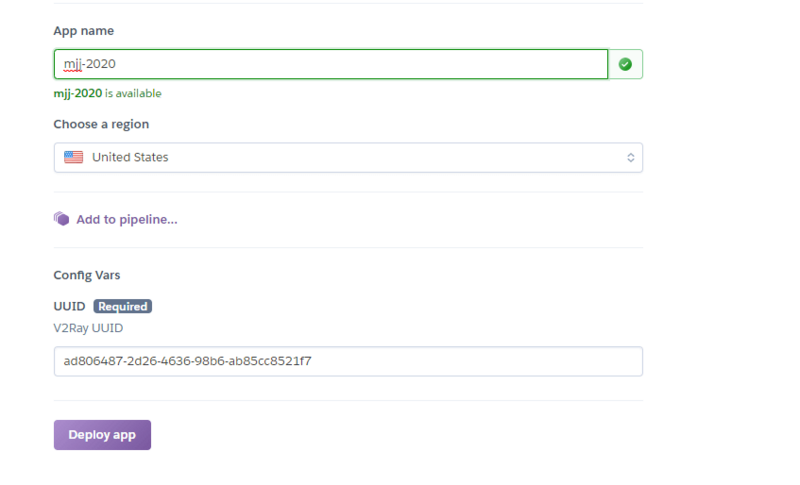
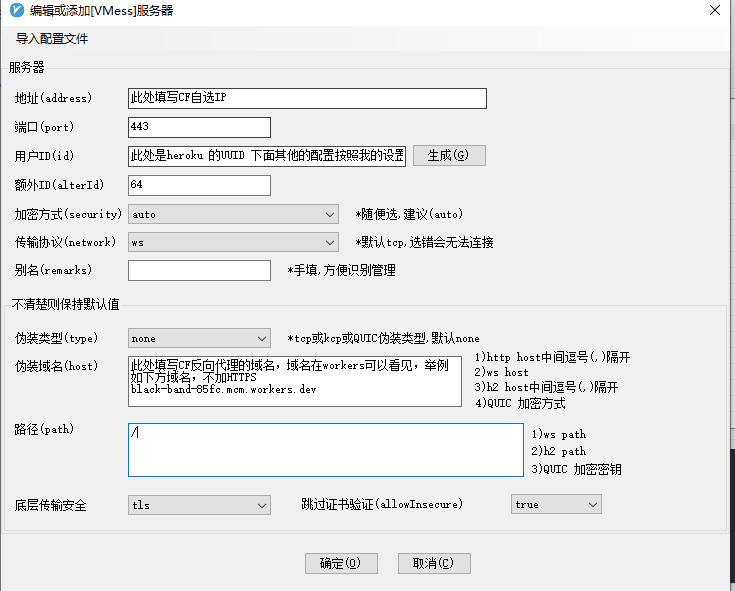

# Heroku 搭建 V2+CF 方法教程

Heroku 是一个支持多种编程语言的云平台即服务，并且提供免费的容器服务（美国、欧洲节点），本文就以免费容器为例，搭建 V2 并配置 CF 加速，你懂得！

注意：Heroku 有滥用危险，后果可能就是封禁账号哦！

### 一、部署Heroku应用 <a href="#yi-pei-zhi-heroku" id="yi-pei-zhi-heroku"></a>

1、首先注册Heroku账号，点击通过 **** [**https://dashboard.heroku.com**](https://dashboard.heroku.com) 注册一个账号，注册时候不能使用QQ邮箱

2、注册成功以后登录，点击[**自动部署链接**](https://dashboard.heroku.com/new?template=https://github.com/iamtrazy/xray-heroku)，名称随便填写就行了，记住uuid备用，然后点击 Deploy app 系统会自动部署



3、部署完成以后，如果刚才未记录UUID，可以点击 Settings 再点击 Reveal Config Vars 就可以看见 UUID了！等会还是用到

4、接着下滑，看见Domains项后有个域名！https://\*\*\*\*\*.herokuapp.com/ 记下域名，稍后配置CloudFlare 反向代理会用到：[](https://img2020.cnblogs.com/blog/1783030/202008/1783030-20200817225353814-2098411255.png)

### 二、配置CloudFlare反向代理 <a href="#er-pei-zhi-cloudflare-fan-xiang-dai-li" id="er-pei-zhi-cloudflare-fan-xiang-dai-li"></a>

1、首先登陆CloudFlare官网，然后点击 右侧的 Workers，点击创建 Workers &#x20;

2、接着复制下方代码，并添加进去！注意把下面的中文替换成你之前在Domains项看见的那个域名前缀：

```
addEventListener(
  "fetch",event => {
     let url=new URL(event.request.url);
     url.hostname="你的heroku域名.herokuapp.com";
     let request=new Request(url,event.request);
     event. respondWith(
       fetch(request)
     )
  }
)
```

[](https://img2020.cnblogs.com/blog/1783030/202008/1783030-20200817225442552-681864788.png)至此！CF就配置完成了，接下来开始配置V2客户端！

### 三、自选IP <a href="#san-pei-zhi-v2-ke-hu-duan" id="san-pei-zhi-v2-ke-hu-duan"></a>

下载自选IP程序，然后windows系统运行即可，全自动化。

[https://huangenet.lanzoui.com/iJ98Hfnppd](https://huangenet.lanzoui.com/iJ98Hfnppdg)

### 四、配置V2客户端 <a href="#si-zi-xuan-ip" id="si-zi-xuan-ip"></a>

配置客户端，请按照图片的要求设置，否则不能联网

v2ray设置



clash设置

.png>)

