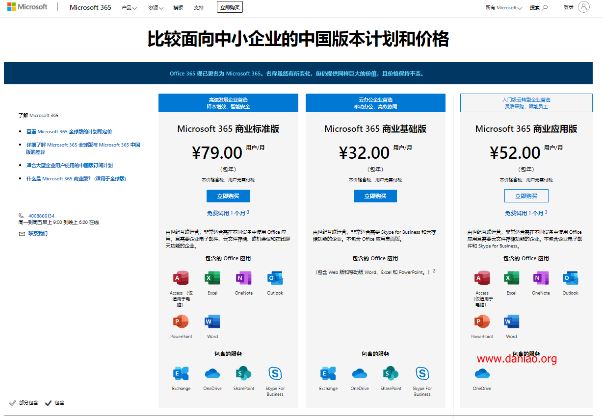

# od E5申请及API开启教程

## E5 账号申请及永久续期教程


续订成功通知



`Office 365 E5` 是微软 `免费` 提供给开发者的 Office 临时 `管理号`，任何人均可申请。该账号的最大权益便是可分配 `25 个子账号`，每个账号都拥有 `OneDrive 5T 存储` 和完整的 `Office 客户端` 使用权。

首次申请，可免费使用 90 天。到期后，根据微软机制，借助 Github Action 或 Tencent Servless 等平台的虚拟环境和定时任务功能，可实现 `永久自动续期`。

### 申请步骤

打开** **[**申请链接**](https://developer.microsoft.com/en-us/office/profile?source=transaction-welcome-email)，`登录` 你的微软账户。如未注册过，点击图中的创建一个，在此不再赘述。


登录成功进入信息填写页面后，选择 `国家`，随意填写 `公司` 名称，勾选 `接受条款` 后，点击 `下一步`。


进入个性化体验页面后，`随意勾选` 几个必选项，点击 `加入`。


进入下个页面后，点击 `设置 E5 订阅`。


在弹出的对话框中填写 `国家`、`用户名`、`域` 和 `密码` 后，点击 `继续`，注意在记事本 `保存你的密码`。

域即 `网址前缀`，填写后可能提示 `已被使用`，改用 `其他字母` 即可。


接着会要求绑定 `手机号`，由于网站使用了 `谷歌` 人机验证，因此需要科学上网。


收到 `验证码` 后，填入对话框，点击 `设置`。


`等待一分钟` 左右，页面将显示订阅成功。


### 开始使用

打开 [**Office 官网**](https://logi.im/go/aHR0cHM6Ly93d3cub2ZmaWNlLmNvbS8|YXV0aD0y)，使用上图中的 `管理员账号` 和第五张图设置的 `密码` 登录。关闭向导后，点击页面中的 OneDrive 和 Word 图标等，即可使用 `网页端` 服务。如需使用 `客户端`，点击右上角的 `安装 Office - Office 365 应用`，使用下载的安装器，跟随步骤安装即可。


### 扩展空间

订阅号默认的 OneDrive 空间是 1T，可在管理页扩展为 5T。打开 [OneDrive 存储管理页](https://logi.im/go/aHR0cHM6Ly9hZG1pbi5vbmVkcml2ZS5jb20vP3Y9U3RvcmFnZVNldHRpbmdz)，`登录` 申请的管理号，将空间设置为 `5012` 后点击 `保存`。如页面 `无法加载`，则系统尚未完成初始化，`等待 24 小时` 后重新打开。


### 子号分配

管理员可分配 25 个子号，每个账号都可使用 Office 365 并拥有 5T OneDrive 空间。点击页面中的 `管理` 按钮，进入管理员中心。


点击左侧菜单栏的 `用户 - 活跃用户`，点击右侧的 `添加用户`，


在弹出的选项卡中，填写 `必要信息` 后，点击 `下一步`。


在接下来的三个步骤中，全部 `保持默认选项`，直接点击 `下一步`，最后 `关闭` 选项卡。

### 开启API

&#x20;Azure（国际版）：**应用注册地址**

### 自动续期

订阅的有效期是 `90` 天。到期前，如果微软检测到账号被用于开发，即 `API 被频繁且无规律调用`，将自动续期。因此，只需编写几行代码，定时高频调用其 API 即可。

`Github Action` 是 Github 提供给开发者使用的 `虚拟 Linux 环境`，可 `根据条件`，例如指定时间，`执行指定代码`。

旧版教程，请忽略

#### 添加任务展开目录

视频教程   0:00 / 0:00速度洗脑循环 00:00

首先 [登录或注册](https://logi.im/go/aHR0cHM6Ly9naXRodWIuY29tLw==) 一个 Github 账号，在此不再赘述。~~随后打开 ~~[~~该仓库~~](https://logi.im/go/aHR0cHM6Ly9naXRodWIuY29tL3ZjaGVja3plbi9BdXRvQXBpU2VjcmV0)~~，点击右上角的 `Fork`~~（Fork 会遭到攻击）。随后[导入私有仓库](https://logi.im/go/aHR0cHM6Ly9kb2NzLmdpdGh1Yi5jb20vY24vZ2l0aHViL2ltcG9ydGluZy15b3VyLXByb2plY3RzLXRvLWdpdGh1Yi9pbXBvcnRpbmctYS1yZXBvc2l0b3J5LXdpdGgtZ2l0aHViLWltcG9ydGVy)。在 `Your old repository’s clone URL` 里填写repocopy

```
https://github.com/vcheckzen/KeepAliveE5.git
```

Privacy 务必选择 `Private`。

点击 `Begin Import`，稍等片刻，你的账号下便会复制一份该项目。

旧版教程，请忽略

现在只需为仓库添加两个密钥 `Secrets`，分别是

| Name   | Value    |
| ------ | -------- |
| USER   | E5 管理员邮箱 |
| PASSWD | E5 管理员密码 |

一定要确保注册成功，否则调用将不是你的账号。

随后转到 `Action` 面板，在 `All workflows` 下找到 `Register APP`，手动触发它完成注册流程，2 分钟左右。

再找到 `Invoke API` 手动触发它看能否成功调用 API。如无错误，任务会定时执行，基本可保证续订成功。最后如果你想使用 OneDrive 搭建个人网盘，可参考 [这些文章](https://logi.im/tag/OneDrive/)。

## 世纪互联打开API

有些校友邮箱不能单独申请API，因为不能进azure，所以最好自己知道如何申请一个。这篇文章就来说说，世纪互联空全局订阅获取Azure+自建独享API！！！

### **购买商业版本的中国版本**

**1）进入Office官网，找到立即购买→商业版→中国版→随便选一种**：

官网：[**传送门在此**](https://www.microsoft.com/zh-cn/microsoft-365/compare-china-global-versions-microsoft-365)



**2）随便选一种购买后，根据提示注册新号等**

.png>)

.png>)

保存后，根据提示进行下一步吧。这里不在赘述。

**2、进入管理，付款**

.png>)

### 开启API

#### 1、打开Azure（世纪互联）：

打开[**应用注册地址**](https://portal.azure.cn/#blade/Microsoft\_AAD\_RegisteredApps/ApplicationsListBlade)，点击 &#x20;

.png>)

.png>)

#### **2、**应用注册

* 应用名称：自行定义，无限制
* 账户类型：必须选择【任何组织目录(任何 Azure AD 目录 – 多租户)中的帐户】
* 重定向 URI：注意键入，不要复制和粘贴
  * rclone类：`http://localhost:53682/`
  * SharePoint：`http://localhost`
  * 其他：可以写自己的域名，注意一定要是https。（或者根据程序要求。）
* 单击注册。复制并保留`应用程序(客户端) ID ，`即为 Client id

.png>)

.png>)

#### 3、应用设置：

* 左侧`证书和密码`，单击`新客户端密码`，复制并保留该密钥，即为secret，注意是复制值，而不是Secret ID！
* 左侧`API权限`，单击`添加权限`，选择`Microsoft Graph`，再选择`委托的权限`。
* 搜索并选择以下权限：
* &#x20;`Files.Read`, `Files.ReadWrite`, `Files.Read.All`, `Files.ReadWrite.All`, `offline_access`, `User.Read`。选择后点击`添加权限`。

OK，现在API已经开启完毕，带着你的客户端ID和密钥去设置rclone账号吧！

[rclone onedrive教程地址](https://rclone.org/onedrive/)     [rclone远程设置教程地址](https://rclone.org/remote\_setup/)
